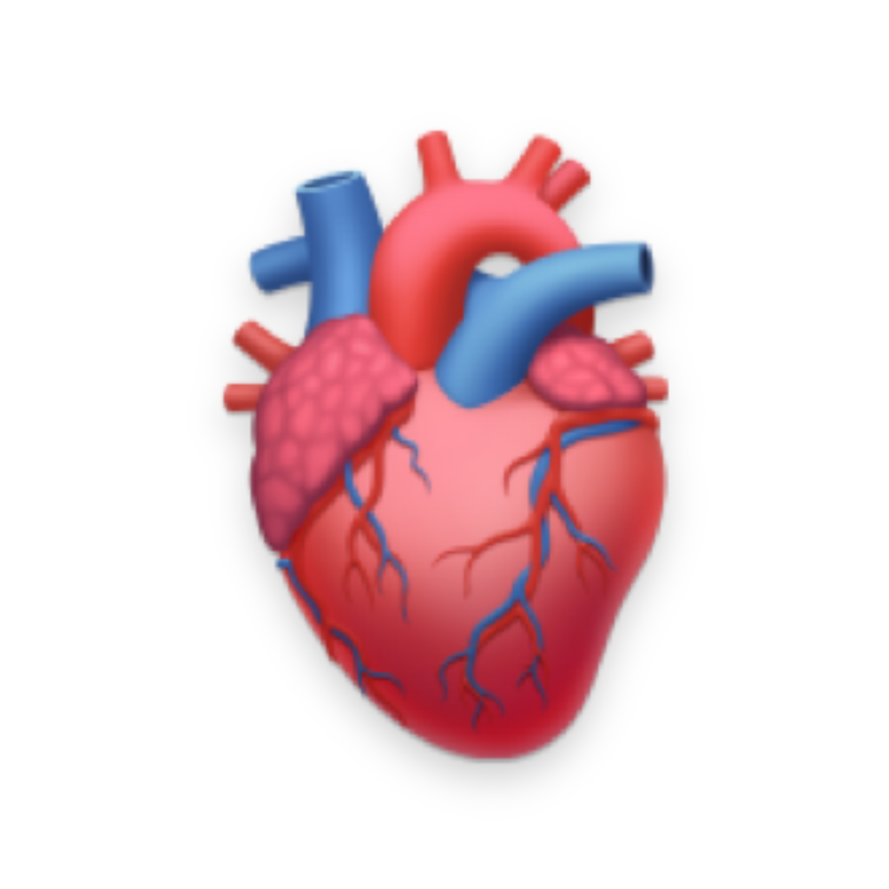
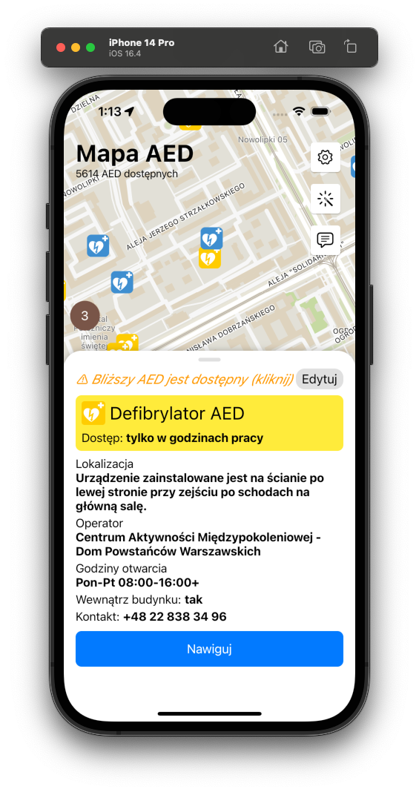

<h1 align="center">
  <br>
  <a href="http://aedmapa.pl/" target="_blank"></a>
  <br><br>
  Mapa AED
</h1>
<h3  align="center">
	
<a href="https://aedmapa.pl">aedmapa.pl</a>
</h3>

<h4 align="center">Mapa automatycznych defibrylatorów zewnętrznych (AED) na Android i iOS</h4>

<p align="center">
  <a href="#Funkcjonalności">Funkcjonalności</a> •
  <a href="#Instalacja">Instalacja</a> •
  <a href="#Technologia">Technologia</a> •
  <a href="#Kompilacja">Kompilacja</a> •
  <a href="#Motywacja">Motywacja</a> •
  <a href="#Plany">Plany</a>
</p>

<p align="center">

</p>

## Funkcjonalności

* Wyświetlanie defibrylatorów na mapie Polski
* Wyswietlanie szczegółów wybranego defibrylatora (lokalizacja, dostęp, godziny pracy, numer telefonu)
* Nawigacja piesza do wybranego defibrylatora
* Tryb ciemny
* Możliwość zgłaszania błędów
* Dodawanie nowych defibrylatorów (wymaga konta [OpenStreetMap](openstreetmap.org))
* Edycja istniejących defibrylatorów (wymaga konta [OpenStreetMap](openstreetmap.org))
* Możliwość zgłaszania błędów
* (za niedługo) możliwość dodawania zdjęć defibrylatora

## Instalacja

Aplikacja może zostać pobrana ze sklepów aplikacji.

<p float="left">
  <a  href="https://apps.apple.com/us/app/mapa-aed-defibrylatory/id1638495701?itsct=apps_box_badge&amp;itscg=30200" style="overflow: hidden; border-radius: 13px; width: 250px; height: 83px;"></a>
  <a style="padding-left:16px;" href='https://play.google.com/store/apps/details?id=pl.enteam.aed_map&utm_source=github_markdown&pcampaignid=pcampaignidMKT-Other-global-all-co-prtnr-py-PartBadge-Mar2515-1'></a>
  </p>

## Technologia
* aplikacja została napisana w technologii [Flutter](https://flutter.dev/)
* dane pochodzą z [bazy danych OSM](https://openaedmap.org/)
* silnikiem nawigacji pieszej jest [Valhalla](https://github.com/valhalla/valhalla/)
* mapa jest renderowana wektorowo, z użyciem silnika [TileServer-gl](https://github.com/maptiler/tileserver-gl)

## Kompilacja
```bash
git clone https://github.com/matisiekpl/aed_map.git
cd aed_map
./build.sh
```

## Motywacja
Pierwotnie stworzyłem aplikację jako test pewnej biblioteki map. Po wrzuceniu jej na sklepy pojawiły się pobrania. Zdecydowałem się bardziej pochylić się nad rozwojem aplikacji oraz nawiązać współpracę z [OpenStreetMap Polska](https://github.com/openstreetmap-polska/). 

*Misją aplikacji jest to, aby każdy, kto udziela pierwszej pomocy wiedział gdzie znajduje się najbliższy defibrylator automatyczny. To może uratować życie.*

# Plany
> Wszystkim osobom, które chciałyby w jakiś sposób pomóc przy rozwoju aplikacji (pisanie postów, marketing...), proszę o kontakt: mateusz@aedmapa.pl
* implementacja funkcji dodawania zdjęć AED
* rozwój bloga [aedmapa.pl/blog](https://aedmapa.pl/blog.html)
* marketing aplikacji - nawiązanie współpracy z influencerami
* marketing aplikacji - promocja na szkoleniach firmowych
