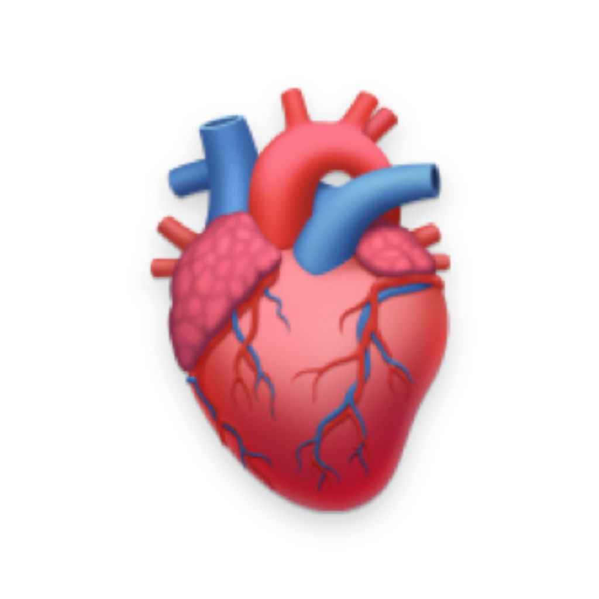
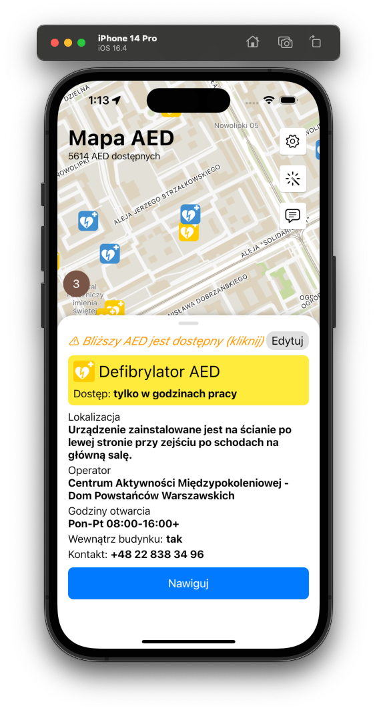

<h1 align="center">
  <br>
  <a href="http://aedmapa.pl/" target="_blank"></a>
  <br><br>
  AED Map
</h1>
<h3  align="center">
	
<a href="https://aedmapa.pl">aedmapa.pl</a> • <a href="README_PL.md">🇵🇱 Wersja polska</a>
</h3>

<h4 align="center">A map of automated external defibrillators (AED) for Android and iOS</h4>

<p align="center">
  <a href="#Features">Features</a> •
  <a href="#Installation">Installation</a> •
  <a href="#Technology">Technology</a> •
  <a href="#Build">Build</a> •
  <a href="#Motivation">Motivation</a> •
  <a href="#Plans">Plans</a>
</p>

<p align="center">

</p>

<p align="center">
  <a href="https://github.com/matisiekpl/aed_map/actions/workflows/flutter.yml">
    
  </a>
  <a href="https://codecov.io/gh/matisiekpl/aed_map">
    
  </a>
  <a href="https://play.google.com/store/apps/details?id=pl.enteam.aed_map">
    
  </a>
</p>

## Features

* Displaying defibrillators on a map of Poland
* Displaying details of a selected defibrillator (location, access, opening hours, phone number)
* Pedestrian navigation to a selected defibrillator
* Dark mode
* Ability to report errors
* Adding new defibrillators (requires an [OpenStreetMap](openstreetmap.org) account)
* Editing existing defibrillators (requires an [OpenStreetMap](openstreetmap.org) account)
* Ability to report errors
* (coming soon) ability to add defibrillator photos

## Installation

The app can be downloaded from the app stores.

<p float="left">
  <a  href="https://apps.apple.com/us/app/mapa-aed-defibrylatory/id1638495701?itsct=apps_box_badge&amp;itscg=30200" style="overflow: hidden; border-radius: 13px; width: 250px; height: 83px;"></a>
  <a style="padding-left:16px;" href='https://play.google.com/store/apps/details?id=pl.enteam.aed_map&utm_source=github_markdown&pcampaignid=pcampaignidMKT-Other-global-all-co-prtnr-py-PartBadge-Mar2515-1'></a>
  </p>

## Technology
* the app was written using [Flutter](https://flutter.dev/)
* data comes from the [OSM database](https://openaedmap.org/)
* the pedestrian navigation engine is [Valhalla](https://github.com/valhalla/valhalla/)
* the map is rendered vectorially, using the [TileServer-gl](https://github.com/maptiler/tileserver-gl) engine
* [analytics](https://analityka.aedmapa.pl/aedmapa.app) available via [Plausible](https://plausible.io/)

## Build
```bash
git clone https://github.com/matisiekpl/aed_map.git
cd aed_map
./build.sh
```

## Motivation
I originally created the app as a test of a certain map library. After publishing it to the stores, downloads started coming in. I decided to focus more on developing the app and to establish a collaboration with [OpenStreetMap Polska](https://github.com/openstreetmap-polska/). 

*The mission of the app is to ensure that anyone providing first aid knows where the nearest automated external defibrillator is located. It can save a life.*

# Plans
> If you would like to help in any way with the development of the app (writing posts, marketing...), please get in touch: mateusz@aedmapa.pl
* implementing the AED photo adding feature
* developing the blog [aedmapa.pl/blog](https://aedmapa.pl/blog.html)
* app marketing - establishing collaboration with influencers
* app marketing - promotion at corporate training sessions
